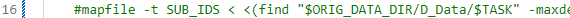
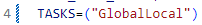
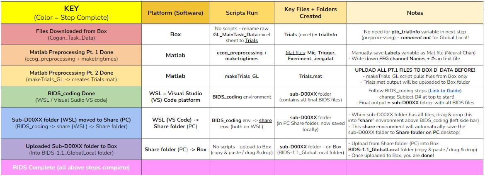
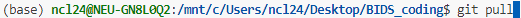
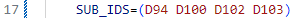
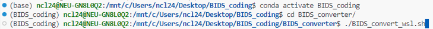
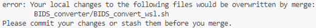
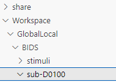

Global Local
============

ecog_preprocessing (Mat) → makeTrials_GL (Mat) → BIDS_coding (WSL)

Step 1: Download data files (Box)
---------------------------------

#. **Go to Box → ECoG_Task_Data → Cogan_Task_Data** and locate the *Subject (D#) folder → Global Local task folder → All blocks* subfolder

#. **Download** **all** **Box** **data files from “All Blocks”** folder

#. Then **Copy + Paste** files into **Local PC** folder in **CoganLabNL** → **InUnit Preprocessing** → **Subject (D#) → Global Local → All blocks**

#. **KEY**: locate the Excel csv file titled: ``GL_MainTask_Data_D#_taskdate``

#. **RENAME this file to** ``Trials``

#. **EDF file**: *2 options - Download (local PC) or Box Drive (no download)*

    #. **Download** : from **TaskUploadDir Box → TaskUploadDir → Download** → move to same local PC Global Local folder (Only if you want to download!)

    #. **Box Drive** : No download, will use Box Drive path in ``edf_filename`` variable instead of local PC path → **See Step 2!**

Step 2: ecog_preprocessing(Matlab)
----------------------------------
*general preprocessing script*

#.  Once your files are downloaded and Trials is renamed, open Matlab and run the **ecog_preprocessing** script *(used for all tasks preprocessing)*

#.  Start the same as all other tasks → create a new ``Case`` for the
    task (Global Local = **009** )

#.  Fill in all of the case variable information accordingly: **see differences!**

    #.  **KEY 1** - for **Global Local only**, the ``ptb_trialInfo`` is commented out! → put a ``%`` (percentage sign) in front! This is because we do not need to get trialInfo – it is replaced by the **Trials** excel sheet we renamed in Step 1.

    #.  **KEY 2** - ``edf_filename`` variable (path) will change depending on if you downloaded the EDF above from Box, or if you are uploading it directly from Box Drive:

        #. **Downloaded EDF** path to InUnit Preprocessing (PC): ``C:\Users\ncl24\Desktop\CoganLabNL\InUnit Preprocessing\D81\Lexical Delay\D# DATE COGAN_TASKNAME.EDF``

        #. **Box Drive EDF** path to TaskUploadDir (Box): ``C:\Users\ncl24\Box\CoganLab\ECoG_Task_Data\TaskUploadDir\D# DATE COGAN_TASKNAME.EDF``

#.  Once all variables are filled out, **highlight + run (F9)** to load into your workspace

#.  Ignore the trialInfo section (don’t need trialInfo) → Go straight to the **edfread + labels** section & run!

#.  This will read the EDF file to create your ``labels`` variable

#.  Then, run the following **extract trigger + mic channel** section

#.  This will create your ``trigger`` & ``mic`` variables, as well as save them as ``trigger.mat`` & ``mic.mat`` files in your task folder.

#.  Finally, run the **.ieeg.dat + experiment** file section, that will save the ``experiment.mat`` & ``.ieeg.dat`` files in your task folder

#. As well as create the folders **mat** & **taskdate** *(e.g.**230807**)*

    #. Move the **experiment** file into the **mat** folder

    #. At the end of Step 5, the **Trials.mat** file will automatically save under the **taskdate (230807) → mat** folder on Box!

Step 3: MaketrigTimes (Matlab)
-------------------------------
*trigTimes + trigTimes_audioAligned files*

#.  When you reach the **maketrigtimes** section, you will open the ``maketrigtimes.m`` script and run it in a separate window next to ecog_preprocessing.

#.  *In order to run maketrigtimes successfully, you will need to have*:

    #.  The **trigger** variable already loaded in your workspace

        * Should already be there if going straight from running ecog_preprocessing – but if not, double-click on trigger saved in folder

    #.  Already run ``edfread_fast``

        * If not, go back and run this in ecog_preprocessing & make sure that your ``edf_filename`` variable (path to EDF) from the case variables is loaded in your workspace before doing so.

#.  Run the first section at the top to load the graph of the triggers

    * **Uncomment the -triggers (negative) linefor Global Local!**

        * Otherwise the graph will appear upside down

#.  Then, proceed as usual and make the trigTimes adjustments you do for all other tasks

    #.  **Global Local-specific Task Info** :

        #. Total # triggers → **trigTimes** = **448**

        #. **4 blocks** total, **112** triggers per block

            #. *Rare cases could have 512 total trigs, 128 per block*

        #. Seconds between triggers = **1.5**

        #. Threshold (thresh) = **-1.25**

            #. Bc graph is inverted / negative from the -triggers line!

    #.  If you need to delete excess triggers (first, last, random in middle) run: ``trigTimes([1,2,3,etc.]) = []``

        * *Fill in brackets with which specific trigger numbers you need to delete!*

    #. Once ``trigTimes = 448``, run the final section to save ``trigTimes.mat`` file to your PC folder!

#. Finally, return to the **ecog_preprocessing** script tab and run the section below, to align the audio to your saved trigTimes

    * This will create the ``trigTimes_audioAligned.mat`` file and save it into your PC folder

Step 4: Upload Files + Copy EDF to Box D_Data
---------------------------------------------

#. **Before moving on! → Upload all files to Box** → **D_Data** from InUnit Preprocessing folder: **Box → D_Data → Global Local → Subject (D#)**

    #. Critical because the **makeTrials_GL script pulls and uses files from Box only! (D_Data Global Local folder specifically)**

        * So before running that script, all files must be uploaded there in order for it to work

    #. Upload the files to D_Data in the exact same way as all other tasks! - only difference = Trials.csv instead of trialInfo

#. **Also! → Copy EDF file into D_Data folder from TaskUploadDir**

    #. The edfread command in this program can only read EDFs / files from the D_Data folder!!!

    #. So you must Copy the EDF from TaskUploadDir into the D_Data folder with the rest of the uploaded files!

    #. SEE BELOW - you must also change Path to EDF!!!

        * Of ``edf_filename`` variable + ``edfread_fast(edf_filename)`` commands!

Step 5: makeTrials_GL (Matlab)
------------------------------
*Global Local only script to make Trials.mat*

#. Once all files have been uploaded to **Box → D_Data** folder, return to Matlab and run the ``makeTrials_GL.m`` script in another separate tab window → this script will output the final ``Trials.mat`` file when finished!

#. **STEPS TO RUN SUCCESSFULLY** *(also written on script!)*

    * **Step 1** : **Copy EDF file into D_Data Box folder!** (from TaskUploadDir)

        * **KEY** - Make sure EDF file is copied into the **D_Data** Subject Global Local folder on Box!

    * **Step 2**: **Edit info** (specific to each subject) + **copy in command line to run each command below (A, B, C) ONE AT A TIME:**

        * 2A) Command 1: change edf_filename variable
            ``edf_filename = ‘C:\Users\ncl24\Box\CoganLab\D_Data\GlobalLocal\D103\240110 COGAN_GLOBALLOCAL.EDF’;``

        * 2B) Command 2: change h variable
            ``h = edfread_fast(‘C:\Users\ncl24\Box\CoganLab\D_Data\GlobalLocal\D103\240110 COGAN_GLOBALLOCAL.EDF’);``

        * 2C) Command 3: run makeTrials_GL function
            ``makeTrials_GL(‘D103’, ‘240110’)``

            #. Must replace: (‘subject’, ‘taskdate’) 1. Replace **subject** with **‘D#’** 2. Replace **date** with **‘taskdate’** (e.g. **‘230807’)**

            #. Final format: ``makeTrials_GL(‘D#’, ‘taskdate’)``

                #. **Example** : D94

                    #. subject = ‘D94’

                    #. date = ‘230807’

                    #. ``makeTrials_GL(‘D94’, ‘230807’)``

            #. You **MUST add the single ‘quotations’** around each of the real variables that you enter, in order for them to be registered as the values for those variables!

        * *Once 2C is finished running, you are done!*

    * **Final output** = **Trials.mat** (when 2C is done ^)

        #. **Trials.mat** file will automatically save under the **taskdate (e.g. 230807) → matfolder on Box**

        #. Example path to locate Trials.mat file:

       * Box -> CoganLab -> D_Data -> GlobalLocal -> D103 (subj) -> 240110(taskdate) -> mat -> Trials.mat

    * If you would like to save it in your local PC folder (InUnit Preprocessing) as well, you can download the file from Box and copy it there! – you don’t have to though.

Step 6: BIDS_coding (WSL → Visual Studio (VS) Code program)
----------------------------------------------------------
*BIDS*

#.  Open WSL

#.  Open ``BIDS_coding`` workspace (folder from Desktop)

    * **File** (top left) → **Open Folder → Desktop → BIDS_coding**

        #. Make sure it opens into **BIDS_convert_wsl.sh** script!

        #. **BIDS_coding → BIDS_converter → BIDS_convert_wsl.sh**

        #. C:/Users/ncl24/BIDS_coding/BIDS_converter/BIDS_convert_wsl.sh

#.  In "**Terminal**" (command window at bottom), type ``git pull``

    * Make sure you are in the right workspace, should look like this:

        #. |image4|

        #. Press **Enter**

#.  If you encounter an **error message!**

    #.  *Message*:
        |image8|

    #.  You will need to make sure all of your changes to **ALL scripts in the workspace** (modified files will have an "**M**" next to them in explorer left side bar) have been **COMMITTED** to Github **before running** the next line, because they will be **ERASED!!!**

        * *To commit changes to github*: type ``git push`` → ``git commit``

    #.  If your only changes are the variables of subject, task, etc. that you make for specific subjects, then you don’t have to commit them – **BUT** , make sure any files you have run for previous subjects with the script are **SAVED TO BOX BEFORE RUNNING the next command**, because they will be **overwritten!!!**

        * To Save to Box:

            * Drag **sub-D00XX** folder into **share** folder above Workspace in WSL explorer → should be in **Share** folder on Desktop, then copy into Box → **BIDS-1.1_GlobalLocal** folder

#. Once all previous subject files have been saved to Box BIDS Global Local folder, you will reset the script!

    #. Type ``git reset --hard`` + Enter!

    #. *Should look like this when idone*:
        |image2|

#. When git reset is done, **re-type git pull** + Enter!

#. **KEY** – **Edits to make to Script after Reset** :

    #. Editing **BIDS_convert_wsl.sh** script!

    #. **EDITS** : *CRITICAL TO CHANGE THESE IN SCRIPT BEFORE RUNNING!*

        #. **Line 4** : Change task to → **TASKS=(“GlobalLocal”)**

            #.  Must change from “SentenceRep” default to GlobalLocal (or any
                task going forward)

                *  Use the exact same name as the D_Data folder!

            #.  **Final** : |image1|

        #. **Line 16** : **Comment out (#) whole** **mapfile** **line!**

            #.  Don’t need for Global Local (will cause error)

            #.  **Final** : *see full line on script* |image0|

        #. **Line 17** : Change **SUB_IDS=(D#)** D# to correct Subject D#’s!

            #.  Can run **multiple subjects at once** , or just **one**

            #.  If running multiple, separate by spaces only! No comma! → *see example below:*

            #.  **Final** : |image5|

        #. **Line 35** : **Comment out (#) the whole line 35!**

            #. Global Local doesn’t have task stimuli, so don’t need this line and it will cause an error if you keep it!

            #. **Final** : *see full line on script* |image6|

            #. Only comment this out for Global Local or tasks that don’t have
                task stimuli!

                * For other future tasks that do, change the ``“sentence_rep”`` task
                    name in the middle of the command line (35) and insert the
                    correct task name to use proper task stimuli!

    #. **CTRL + S** TO SAVE ALL EDITS TO SCRIPT!!!

#. When all edits have been made to script & saved ( **ctrl + s** ), type ``conda activate BIDS_coding`` + Enter!

#. The conda activate command will change (base) at the start of the command path to (BIDS_coding)

    * Once the new command line pops up below:

        * Type ``cd BIDS_converter`` + Enter!

#. within BIDS_coding (adds it to end of path), which is where you can now run the script to perform the BIDS conversion functions

    * Once the next command line pops up below with /BIDS_converter at the end: type ``./BIDS_convert_wsl.sh`` + Enter!

**STEPS 8, 9, 10 SHOULD LOOK LIKE THIS** : (in order top → bottom!)

    |image7|

#. The script should then run for a few minutes (10-15 min) after entering the last command to create all of the converted BIDS files!

    #. Final output will be on the left side bar (WSL Explorer)

        * *To open explorer*: click double paper icon at top left corner

    #. Under **ncl24 → Workspace → GlobalLocal → BIDS**

        * Locate the **sub-D0XXX** folder!

            #. i.e. sub-D0100 for Subject D100

            #. |image9|

               * This is where all of the finalized BIDS files will go!

#. Last step: move to **share** folder (on WSL)

    * When it is finished creating BIDS files, in the left side bar with workspaces, drag and drop this **sub-D00XX** output folder containing the BIDS files into the " **share**" folder above Workspace! (see top of pic above) 1. Then you will be able to access it from **Share PC** folder on Desktop! → if not moved to share, can’t access on Windows

Final Step: Upload sub-D00XX on Share folder to Box BIDS-1.1_GlobalLocal
-------------------------------------------------------------------------

    * Copy **sub-D00XX** with all finalized BIDS file outputs from **Share** PCfolder into **Box → CoganLab → BIDS-1.1_GlobalLocal → BIDS** folder!

|image3|

.. |image2| image:: media/image3.png

.. |image6| image:: media/image7.png

